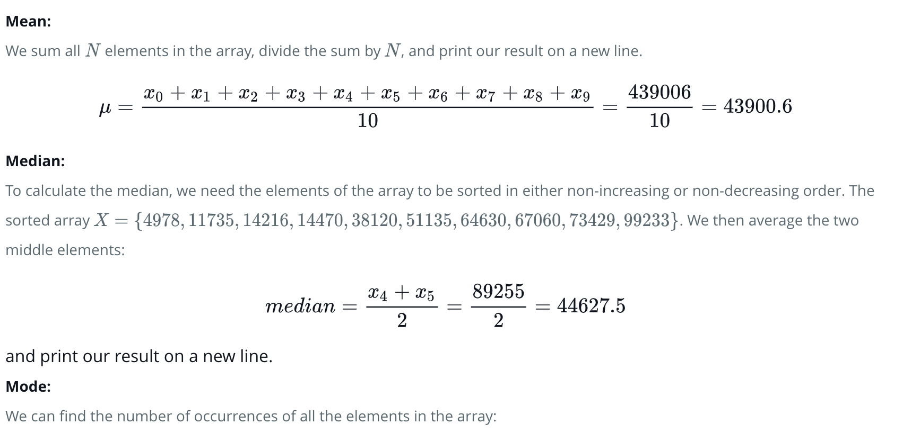
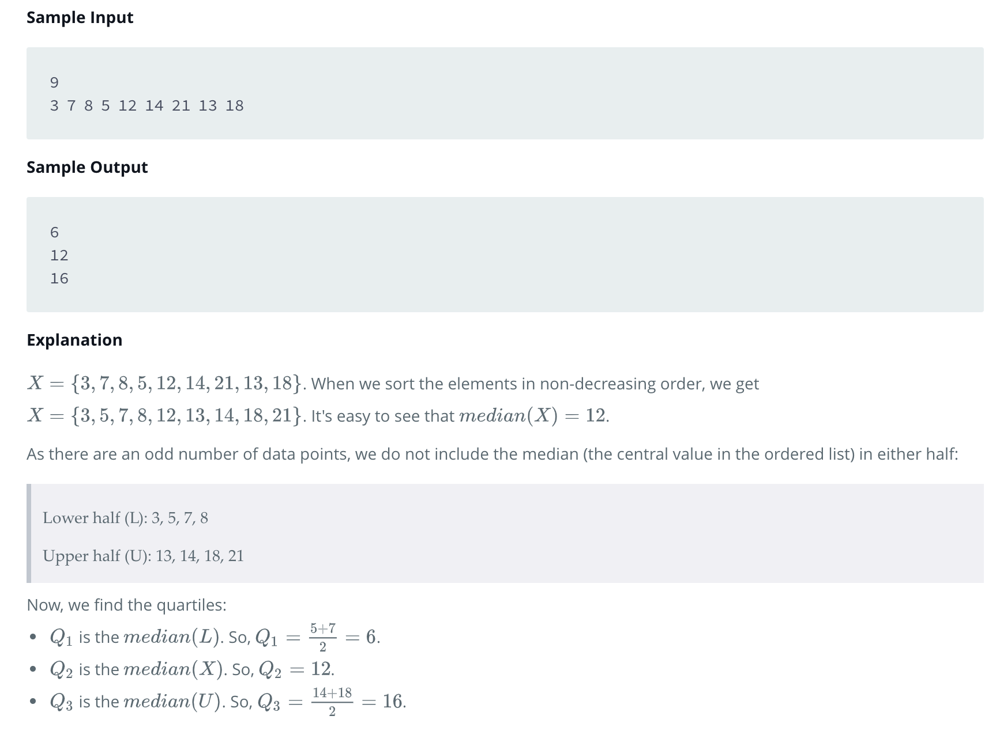
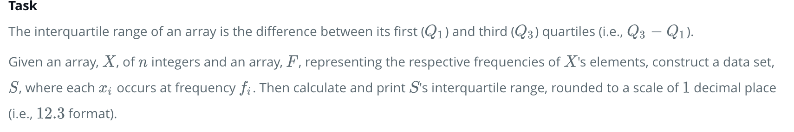
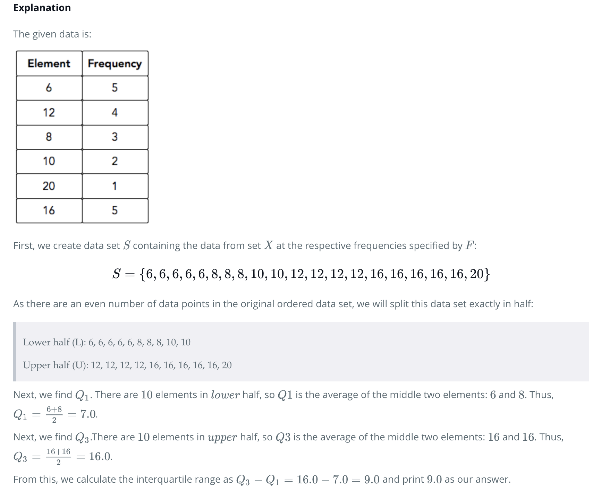
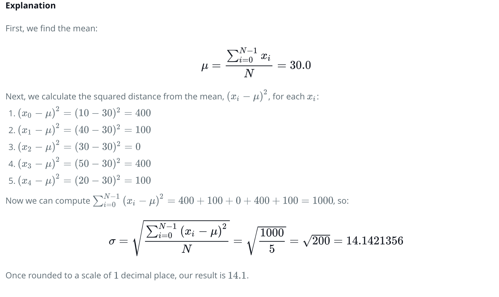

# 10 Days Statistics in Hacker Rank

Please find the below problem statements and corresponding problem solution in my gitrepo

### Day 0 Mean Median and Mode

Objective 
In this challenge, we practice calculating the mean, median, and mode. Check out the Tutorial tab for learning materials and an instructional video!

Task 
Given an array X of N integers, calculate and print the respective mean, median, and mode on separate lines. If your array contains more than one modal value, choose the numerically smallest one.

Note: Other than the modal value (which will always be an integer), your answers should be in decimal form, rounded to a scale of 1 decimal place (i.e.12.3,7.0,format).

### Day 0: Weighted Mean 

### Day 1 Quartiles 

### Day 1 Interquartile Range

Task : 

### Day 1: Standard Deviation

Given an array, X of N integers, calculate and print the standard deviation.
Your answer should be in decimal form, rounded to a scale of 1 decimal place (i.e.12.3 format).
An error margin of +/-0.1 will be tolerated for the standard deviation.

### Day 2: Basic Probability

## Author

* Prasanna Kumar 

